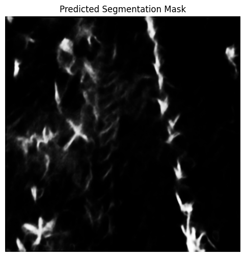
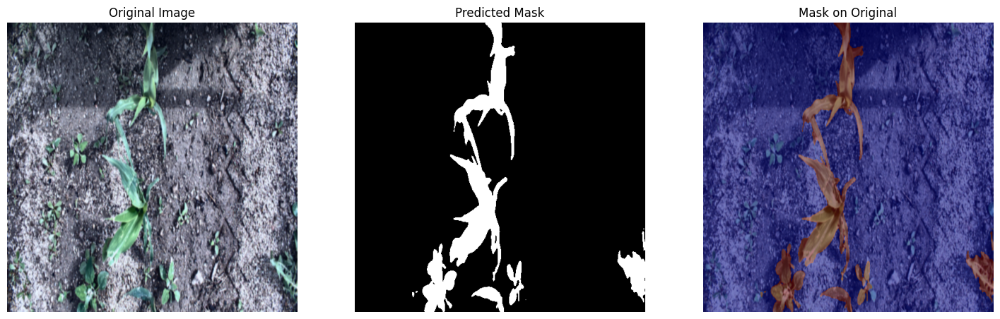
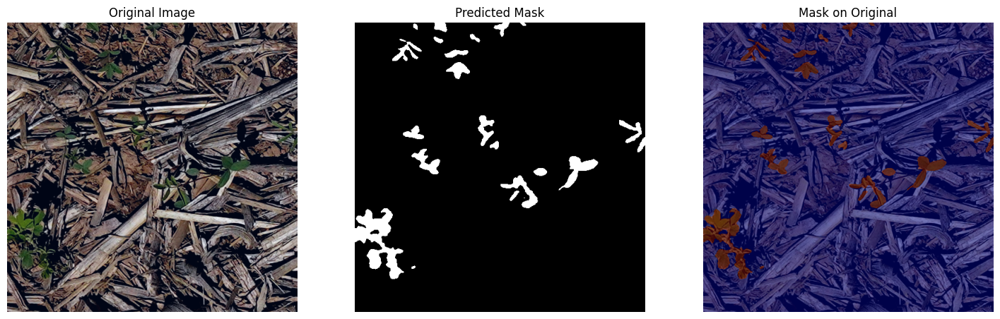
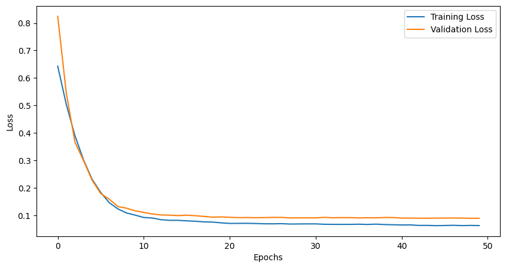

# 🌽 Corn-Segmentation-Model

This repository implements a deep learning model for **segmenting corn crop images** into two classes:
- 🌱 Green Vegetation  
- 🖫 Background  

Inspired by the **SegVeg** architecture, this model utilizes a **U-Net model with a ResNet-50 encoder**, optimized for pixel-wise semantic segmentation of high-resolution corn field imagery.

> 🚀 Trained using **Google Colab** with GPU acceleration.

---

## 🧐 About the Model

The model predicts a binary mask for each input image:
- **Class 0** → Background  
- **Class 1** → Green Vegetation  

It was trained using high-resolution RGB images and their corresponding binary segmentation masks.

---

## 📂 Dataset Structure

> ⚠️ Dataset not included in this repo. Please provide your own dataset using the structure below:

```
data/
├── images/
│   ├── sample1.jpg
│   ├── sample2.jpg
│   └── ...
└── Anotations/
    ├── sample1_mask.png
    ├── sample2_mask.png
    └── ...
```

- Image and mask filenames must align (e.g., `image1.jpg` → `image1_mask.png`)
- Masks should be grayscale images with values `0` (background) and `1` (green vegetation)

---

## 🚀 Quick Start

### 1. Clone and Install

```bash
git clone https://github.com/your-username/Corn-Segmentation-Model.git
cd Corn-Segmentation-Model
pip install -r requirements.txt
```

---

### 2. Train the Model

```bash
python train.py
```

Configure paths and training parameters in `config.py`.

---

### 3. Run Inference

```bash
python infer.py --img path/to/your_image.jpg
```

Predicted masks will be shown and optionally saved in the `outputs/predictions/` folder.

---

## 🗄️ Sample Output

Below are example results generated by the model:

| Inference | Overlay | Test Example |
|-----------|---------|--------------|
|  |  |  |

You can also find the training performance curve here:

- 📈 Training Chart: 

These files are stored in the `outputs/` folder.

---

## ☁️ Google Colab

This project was developed and trained in [Google Colab](https://colab.research.google.com/).  
Use the demo notebook for a full walkthrough:

### I will add more trading notebooks during this development with all the variations and on different datasets and different methods

📓 `notebooks/demo_colab.ipynb`

---

## 📁 Outputs Folder

During training and inference, results are saved to:

```
outputs/
├── checkpoints/         # Model weights (e.g., epoch_10.pt)
├── logs/                # Training loss, metrics (optional)
├── predictions/         # Inference masks (if saved)
├── corn_cro_prediction.png
├── infernce_on_test.png
├── test_infernce.png
└── training_chart.png
```

---

## 📃 License

This project is licensed under the MIT License. See the `LICENSE` file for more details.

---

## 🙌 Acknowledgements

- Based on the architecture and idea of [SegVeg](https://github.com/AussieWheat/SegVeg).
- Trained and evaluated using Google Colab + PyTorch.
